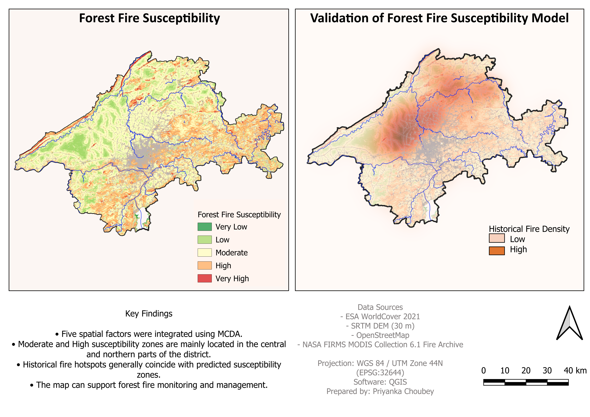

#  Forest Fire Susceptibility Mapping of Jabalpur District, Madhya Pradesh

**A GIS-Based Multi-Criteria Decision Analysis (MCDA) Approach**

---

##  Project Overview

This project presents a GIS-based Forest Fire Susceptibility Mapping for Jabalpur District, Madhya Pradesh, India using Multi-Criteria Decision Analysis (MCDA) in QGIS. The objective was to identify areas vulnerable to forest fires by integrating multiple environmental and anthropogenic factors and validating the model using historical fire occurrence data.

---

##  Study Area

**Jabalpur District, Madhya Pradesh, India**

---

##  Forest Fire Susceptibility Map

> Upload your final susceptibility map to the `maps` folder and insert it here.

```markdown

```

---

##  Model Validation

Historical fire occurrences from **NASA FIRMS MODIS Collection 6.1 Fire Archive** were used to validate the susceptibility model.
---

##  Objectives

- Develop a Forest Fire Susceptibility Model using GIS.
- Integrate multiple spatial factors using MCDA.
- Identify high-risk fire-prone areas.
- Validate the model using historical fire records.

---

##  Datasets Used

| Dataset | Source |
|----------|--------|
| Land Cover | ESA WorldCover 2021 |
| DEM (30 m) | SRTM |
| Roads | OpenStreetMap |
| Settlements | OpenStreetMap |
| Rivers | OpenStreetMap |
| Historical Fire Data | NASA FIRMS MODIS Collection 6.1 |

---

##  Methodology

1. Data Preparation
2. DEM Processing
   - Slope
   - Aspect
3. Distance Analysis
   - Roads
   - Settlements
4. Land Cover Reclassification
5. Weighted Overlay (MCDA)
6. Forest Fire Susceptibility Mapping
7. Model Validation using NASA FIRMS Fire Archive

---

##  Factors Used

| Factor | Purpose |
|---------|----------|
| Slope | Influences fire spread |
| Aspect | Controls solar exposure |
| Land Cover | Represents vegetation type |
| Distance to Roads | Human-caused ignition potential |
| Distance to Settlements | Anthropogenic fire influence |

---

##  Validation Results

Historical fire detections were compared with the predicted susceptibility classes.

| Risk Class | Fire Points | Percentage |
|------------|------------:|-----------:|
| Very Low | 13 | 0.04% |
| Low | 5,447 | 16.34% |
| Moderate | 23,499 | 70.50% |
| High | 4,066 | 12.20% |
| Very High | 310 | 0.93% |

The validation indicates that historical fire occurrences are concentrated predominantly within the Moderate and High susceptibility zones, while very few fires occurred in the Very Low susceptibility class.

---

##  Key Findings

- Five spatial factors were integrated using Multi-Criteria Decision Analysis (MCDA).
- Moderate and High susceptibility zones are concentrated in the central and northern parts of Jabalpur District.
- Historical fire hotspots show spatial agreement with predicted susceptibility zones.
- The model can support forest fire monitoring, prevention, and management planning.

---

##  Software Used

- QGIS
- GDAL
- OpenStreetMap Data
- NASA FIRMS

---

##  Repository Structure

```
forest-fire-susceptibility-jabalpur/
│
├── maps/
├── outputs/
├── qgis_project/
├── report/
├── screenshots/
└── README.md
```

---

##  Future Improvements

- Incorporate NDVI from Sentinel-2 imagery.
- Include climatic variables such as rainfall, temperature, and wind speed.
- Apply Analytical Hierarchy Process (AHP) for weight determination.
- Compare MCDA results with Machine Learning-based susceptibility models.

---

##  Author

**Priyanka Choubey**

GIS | Forestry | Remote Sensing Enthusiast

---
